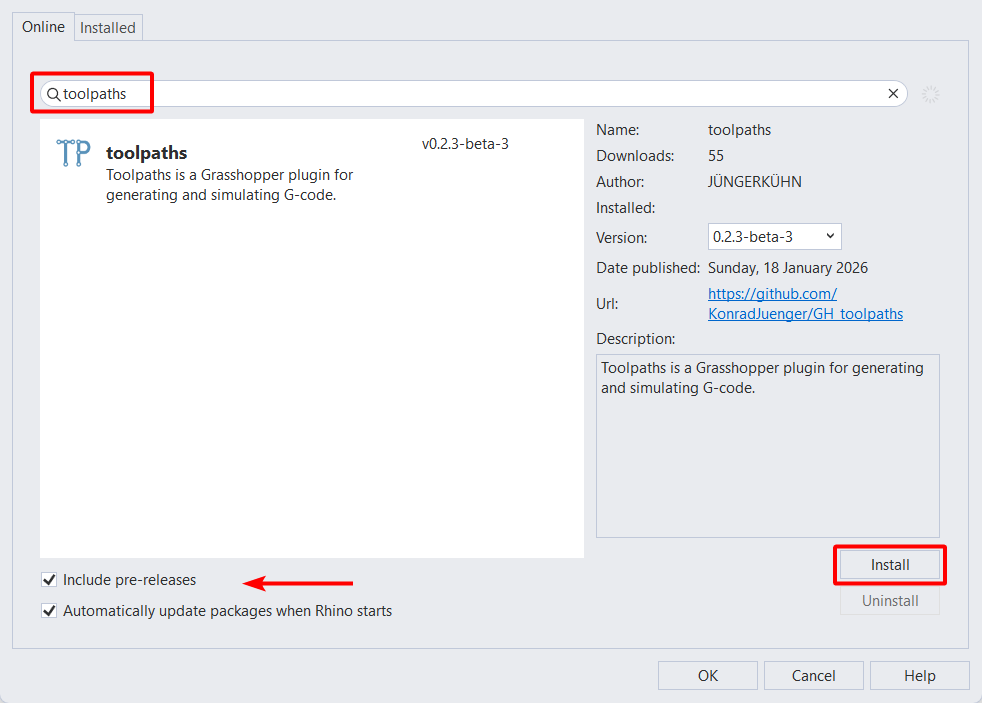
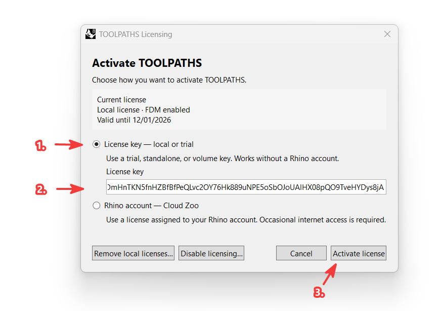
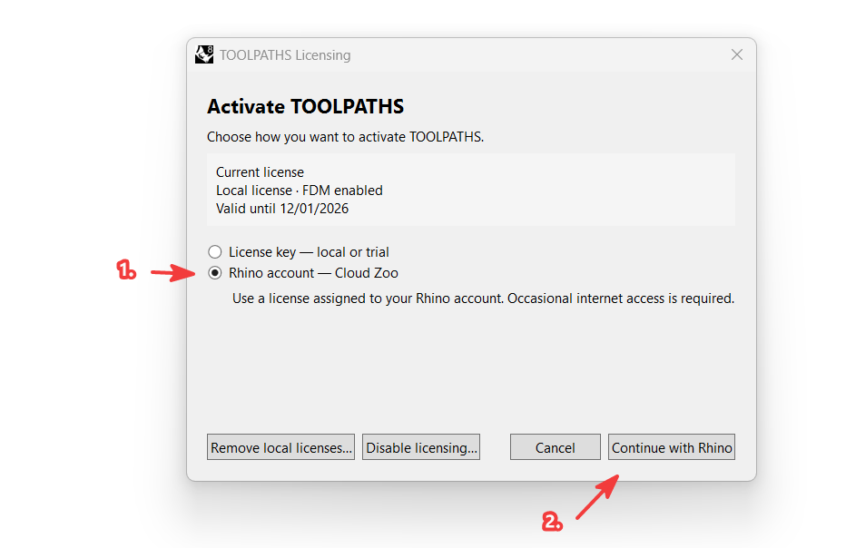
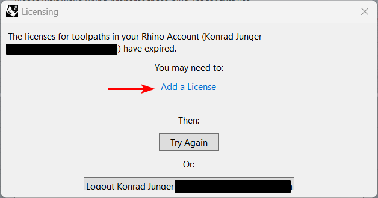
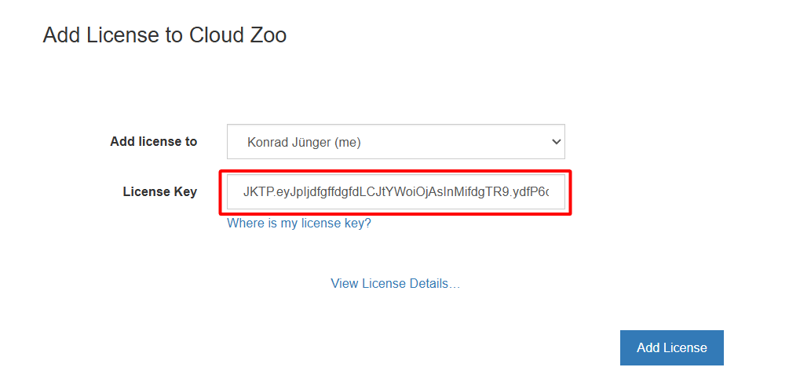
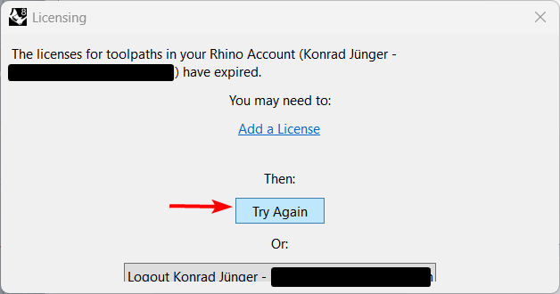

TOOLPATHS has two licensing options. On first installation, **License key — local or trial** is selected by default.

1. **Local license / trial**

   Enter a trial, standalone, or volume key. Local licenses work without a Rhino account and can be used offline after activation.

2. **Rhino account / Cloud Zoo**

   This option is intended for licenses managed through your Rhino account. You can use the license on any machine where you are signed in. It requires an internet connection from time to time.

##  Install TOOLPATHS

1. In Rhino: open the Package Manager by running `_PackageManager`.
2. Check **Include pre-releases** and search for **Toolpaths**, then install it.

   

##  Add your local or trial license

After installing TOOLPATHS, the Toolpaths licensing popup opens:

1. Leave **License key — local or trial** selected.
2. Paste your key.
3. Click **Activate license**.

   

The dialog checks the entered key before saving it. If the key is invalid or expired, it remains open and shows the problem without changing the installed license.

##  Add your Cloud Zoo license

After installing TOOLPATHS, the Toolpaths licensing popup opens:

1. Choose **Rhino account — Cloud Zoo** and click **Continue with Rhino**.

   

2. The Rhino licensing popup opens; select **Add license**.

   

3. Your browser opens, asking you to add a license to your Rhino account.

   

4. Go back to Rhino and press **Try again**. Rhino should now fetch the license from Cloud Zoo.

   

##  Change or disable your license

Run `ToolpathsLicenseMode` in Rhino. The dialog shows the active license, enabled TOOLPATHS features, and expiry where applicable. You can switch between Cloud Zoo and a local key or remove installed local licenses. **Disable licensing…** stops license checks and startup prompts; licensed TOOLPATHS features remain unavailable until you run `ToolpathsLicenseMode` and enable licensing again.

Cancelling the dialog leaves the current license unchanged. On first installation, **Not now** closes the dialog without starting Cloud Zoo; TOOLPATHS asks again on a later startup until a licensing method is completed.
