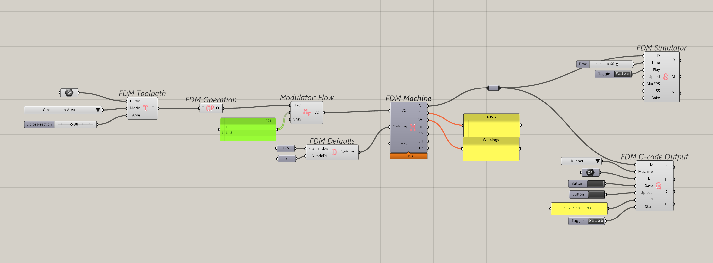

# FDM Overview

A typical FDM workflow in Grasshopper is built from the components below. Together they take a polyline curve and extrusion parameters, simulate it  and turn it into G-code.

- **Input Curve** - Supplies the polyline you want to print. Curves must be converted to polylines before they can be used.
- **FDM Toolpath** - Translates Grasshopper geometry into a toolpath object the downstream tools can process.
- **FDM Operation** (optional) - Groups multiple toolpaths, so you can manage shared settings once and apply them to every input toolpath.
- **FDM Modulator** - Adjusts specific aspects of a toolpath or operation, such as extrusion flow or speed, along its length.
- **FDM Machine** - Compiles the configured operations and toolpaths into a single program.
- **FDM Defaults** - Stores global configuration such as start/end G-code snippets and other common printer settings.
- **FDM Simulator** - Simulates the program and previews the resulting mesh in the Rhino viewport.
- **FDM G-code** - Exports the final, printer-ready G-code to a file or uploads it straight to the machine.
